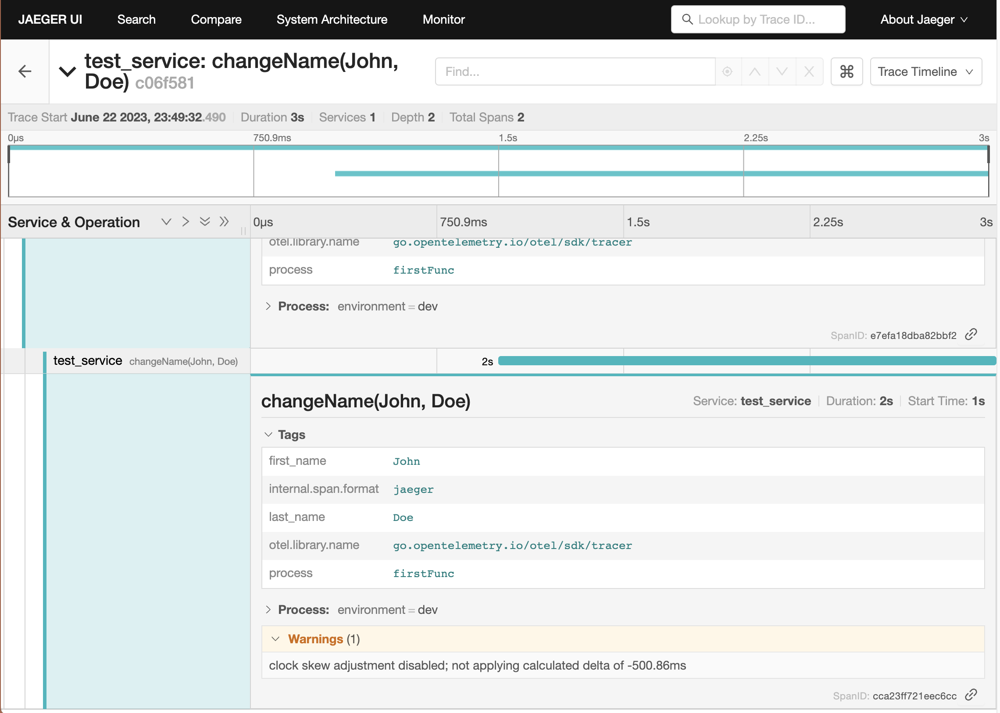

# go-jaeger
Tracing library for Go applications using OpenTelemetry. This library hooks into the logrus library.

## Usage
Please see the [examples](https://github.com/cksidharthan/go-jaeger/blob/main/example/example.go) directory for usage examples.

## Running the example
1. Run the Jaeger all-in-one docker image
```bash
task run-jaeger
```
2. Run the example
```bash
task run-example
```
3. Open the Jaeger UI
```bash
task open-jaeger-ui
```

# Screenshots
After running the example, you can see the traces in the Jaeger UI as shown below.



# Contributing
Please feel free to raise issues and submit PRs.
